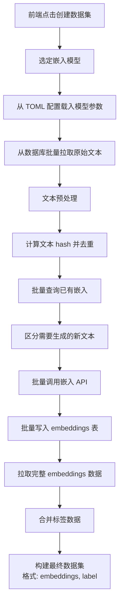
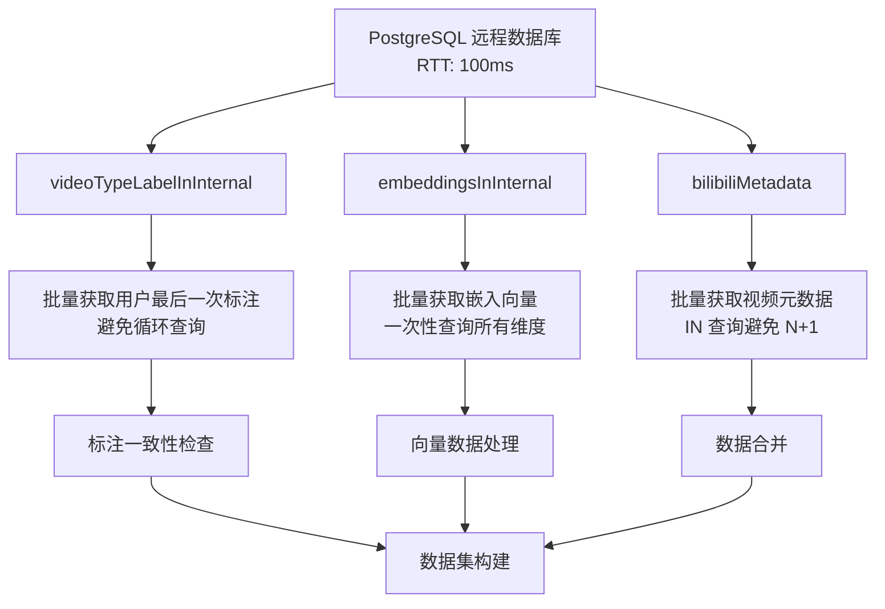
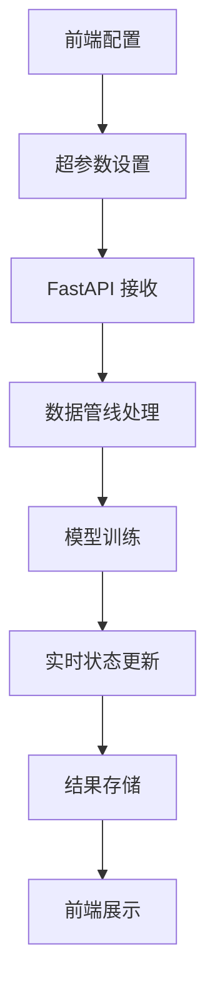

# CVSA ML 基础设施重构项目

## 项目概述

本项目旨在重构现有的 ML 服务基础设施，从原始的 `ml/filter` 系统迁移到新的前后端分离架构。主要目标是为 ML 训练、实验管理和数据处理提供一个现代化的 Web UI 界面。

### 核心功能

- **数据管线管理**: 从 PostgreSQL 数据库获取和预处理训练数据
- **实验管理**: 训练参数配置、实验追踪和结果可视化
- **超参数调优**: 动态超参数配置和调整
- **数据标注界面**: 简单易用的数据标注和管理工具
- **模型训练**: 2分类视频分类模型训练
- **嵌入向量管理**: 支持多种嵌入模型和向量维度

## 架构设计

### 技术栈

- **前端**: React + TypeScript + Vite + Tailwind CSS + shadcn/ui
- **后端**: FastAPI + Python
- **数据库**: PostgreSQL + Drizzle ORM
- **向量数据库**: PostgreSQL pgvector
- **包管理**: Bun (TypeScript) + pip (Python)

### 分层架构

```
┌─────────────────┐    ┌──────────────┐    ┌──────────────────┐
│   Web UI        │    │  FastAPI     │    │  Database        │
│  (React TS)     │◄──►│  (Python)    │◄──►│ (PostgreSQL)     │
└─────────────────┘    └──────────────┘    └──────────────────┘
```

## 目录结构

### 前端项目 (`packages/ml_panel/`)

```
packages/ml_panel/
├── src/                     # 前端应用
│   ├── App.tsx              # 主应用组件
│   ├── main.tsx             # 应用入口
│   ├── index.css            # 全局样式
│   └── lib/
│       └── utils.ts         # 前端工具函数
├── lib/                     # 核心库文件
│   ├── types.ts             # 共享类型定义
│   ├── ml-client.ts         # ML API 客户端
│   ├── data-pipeline/       # 数据管线类型
│   │   └── types.ts
│   └── index.ts             # 导出文件
├── package.json
├── vite.config.ts
└── tailwind.config.js
```

### 后端服务 (`ml_new/training/`)

```
ml_new/training/
├── main.py                  # FastAPI 主服务
├── requirements.txt         # Python 依赖
└── ...                     # 其他服务文件
```

### 数据库 Schema

使用现有的 `packages/core/drizzle/main/schema.ts` 中的定义：

- `videoTypeLabelInInternal`: 用户标注数据
- `embeddingsInInternal`: 嵌入向量存储
- `bilibiliMetadata`: 视频元数据

## 已完成的工作

### 1. 核心类型定义

**文件**: `packages/ml_panel/lib/types.ts`

- 定义了核心数据结构
- `DatasetRecord`: 数据集记录
- `UserLabel`: 用户标注
- `EmbeddingModel`: 嵌入模型配置
- `TrainingConfig`: 训练配置
- `ExperimentResult`: 实验结果
- `InconsistentLabel`: 标注不一致数据

### 2. 数据管线类型

**文件**: `packages/ml_panel/lib/data-pipeline/types.ts`

- `VideoMetadata`: 视频元数据
- `VideoTypeLabel`: 标注数据
- `EmbeddingRecord`: 嵌入记录
- `DataPipelineConfig`: 管线配置
- `ProcessedDataset`: 处理后的数据集

### 3. ML 客户端

**文件**: `packages/ml_panel/lib/ml-client.ts`

- `MLClient` 类用于与 FastAPI 通信
- 超参数获取和更新
- 训练任务启动和状态监控
- 实验管理
- 嵌入生成接口

### 4. FastAPI 服务框架

**文件**: `ml_new/training/main.py`

- 基础的 FastAPI 应用配置
- CORS 中间件配置
- 内存存储的训练会话管理
- 基础的 API 端点定义

### 5. 项目配置

- **前端**: `packages/ml_panel/package.json` - React + Vite + TypeScript 配置
- **后端**: `ml_new/training/requirements.txt` - Python 依赖
- **主项目**: `packages/ml/package.json` - Monorepo 工作空间配置

## 核心功能实现状态

### 已完成

- [x] 基础项目结构搭建
- [x] 核心类型定义
- [x] ML API 客户端
- [x] FastAPI 服务框架
- [x] 前端项目配置

### 待实现

- [ ] 数据管线核心逻辑实现
- [ ] React UI 组件开发
- [ ] FastAPI 服务功能完善
- [ ] 数据库连接和数据获取逻辑
- [ ] 用户标注数据处理
- [ ] 嵌入向量管理
- [ ] 标注一致性检查
- [ ] 训练任务队列
- [ ] 实验追踪和可视化
- [ ] 超参数动态配置
- [ ] 完整的前后端集成测试

## 数据流程设计

### 1. 数据集创建流程 (高 RTT 优化)



### 2. 数据获取流程 (数据库优化)



### 3. 训练流程



## 技术要点

### 1. 高性能数据库设计 (RTT 优化)

- **批量操作**: 避免循环查询，使用 `IN` 语句和批量 `INSERT/UPDATE`

### 2. 嵌入向量管理

- **多模型支持**: `embeddingsInInternal` 支持不同维度的向量 (2048/1536/1024)
- **去重机制**: 使用文本 hash 去重，避免重复生成嵌入
- **批量处理**: 批量生成和存储嵌入向量
- **缓存策略**: 优先使用已存在的嵌入向量

### 3. 2分类模型架构

- 从原有的 3分类系统迁移到 2分类
- 输入: 预计算的嵌入向量 (而非原始文本)
- 支持多种嵌入模型切换

### 4. 数据一致性处理

- **用户标注**: `videoTypeLabelInInternal` 存储多用户标注
- **最后标注**: 获取每个用户的最后一次标注作为有效数据
- **一致性检查**: 识别不同用户标注不一致的视频，标记为需要人工复核

## 后续开发计划

### Phase 1: 核心功能 (优先)

1. **数据管线实现**
    - 标注数据获取和一致性检查
    - 嵌入向量生成和存储
    - 数据集构建逻辑

2. **FastAPI 服务完善**
    - 构建新的模型架构（输入嵌入向量，直接二分类头）
    - 迁移现有 ml/filter 训练逻辑
    - 实现超参数动态暴露
    - 集成 OpenAI 兼容嵌入 API
    - 训练任务队列管理

### Phase 2: 用户界面

1. **数据集创建界面**
    - 嵌入模型选择
    - 数据预览和筛选
    - 处理进度显示

2. **训练参数配置界面**
    - 超参数动态渲染
    - 参数验证和约束

3. **实验管理和追踪**
    - 实验历史和比较
    - 训练状态实时监控
    - 结果可视化

### Phase 3: 高级功能

1. **超参数自动调优**
2. **模型版本管理**
3. **批量训练支持**
4. **性能优化**

## 注意事项

1. **数据库性能**: 远程数据库 RTT 高，避免 N+1 查询，使用批量操作
2. **标注一致性**: 实现自动的标注不一致检测
3. **嵌入模型支持**: 为未来扩展多种嵌入模型预留接口
